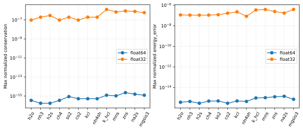
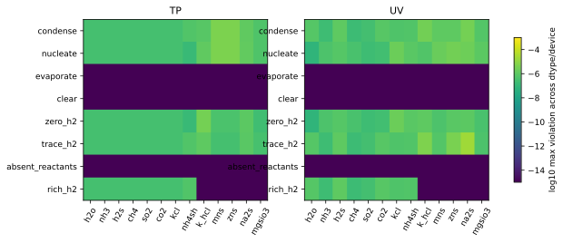
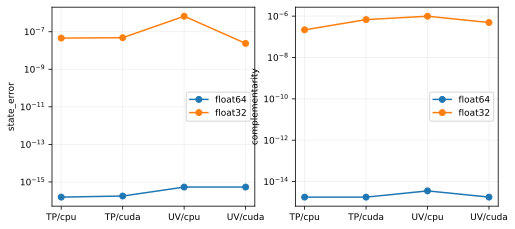
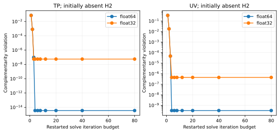
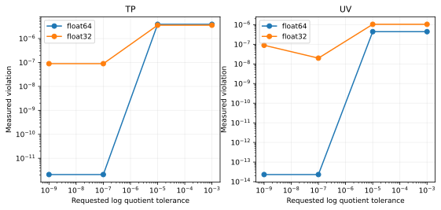

TP and UV equilibrium with background gases
===========================================

``ThermoX`` solves saturation adjustment at specified temperature and pressure
(TP). ``ThermoY`` solves at fixed volume and total internal energy (UV). Both
use reaction extents, so an explicit H2 product changes composition, pressure
and heat capacity. An inert gas also contributes to gas pressure and energy.
Neither gas is a fixed abundance reservoir.

These are ideal-gas, pure-condensate saturation solvers for the supplied
reaction network. They do not discover missing reactions or minimize a general
nonideal mixture Gibbs energy. Equilibrium coefficients and caloric data must
be thermodynamically consistent for physical UV predictions. The
:doc:`reactions/index` separates source verification from numerical validation.

Phase declarations and ordering
-------------------------------

Species YAML accepts ``phase: gas``, ``phase: liquid`` or ``phase: solid``.
Declare H2 as gas even when it appears on the product side. Declare inert gases
as gas so that species with no reaction participation still enter the EOS.
For example::

   species:
     - {name: He, phase: gas, composition: {He: 1}, cv_R: 1.5}
     - {name: Mn, phase: gas, composition: {Mn: 1}, cv_R: 1.5}
     - {name: H2S, phase: gas, composition: {H: 2, S: 1}, cv_R: 3.0}
     - {name: H2, phase: gas, composition: {H: 2}, cv_R: 2.5}
     - {name: MnS(s), phase: solid, composition: {Mn: 1, S: 1}, cv_R: 3.0, u0_R: -3000.}

This fragment illustrates classification; it is not a calibrated MnS model.
Supply a verified reaction quotient and appropriate caloric data for actual
calculations. The numerical tests instead generate complete manufactured
cards in ``docs/reaction_validation.py``.

With no explicit phase, legacy inference remains: the first reference species
and nucleation reactants are gases, nucleation products are condensates.
Contradictory classifications and condensed nucleation reactants are rejected.
A nucleation reaction must have a condensed product. Programmatic
``vapor_ids``/``cloud_ids`` remain authoritative when constructing options
without YAML inference. Arrays use the resulting ``options.species()`` order:
gases first, condensates last. Do not infer array indices from reaction text.

Call ``relative_humidity(T, conc, stoich, op.nucleation(), ngas)`` with the
number of gases for networks with gaseous products. The four-argument call
retains the legacy reactant-only interpretation and raises for options known
to contain gas products. Concentrations are mol/m³. A zero reactant can give
zero RH and a zero product gas can give infinite RH; simultaneous zeros on
opposite sides have no uniquely defined quotient. The solver treats a reaction
with missing gases on both sides as locally blocked until another reaction
supplies one of them.

Signed quotient and phase conditions
------------------------------------

Let :math:`\nu_{ij}` be positive for products and negative for reactants.
For gas species define :math:`a_{ij}=-\nu_{ij}` and
:math:`A_j=\sum_{i\in g}a_{ij}`. The stored function is

.. math::

   L_j(T)=\ln Q_j^{\mathrm{sat}}(T),\qquad
   r_j=\sum_{i\in g}a_{ij}\ln p_i-L_j(T).

Pressures inside the logarithms mean their numerical values in Pa.
This convention matters whenever :math:`A_j\ne0`. If a publication uses
bar, convert :math:`L_{\mathrm{Pa}}=L_{\mathrm{bar}}+A_j\ln 10^5`.
For a conventional dimensionless forward equilibrium constant :math:`K_p`,
:math:`L=-\ln K_p+A_j\ln(p^\circ/\mathrm{Pa})`.

For example, Mn + H2S -> MnS(s) + H2 has
:math:`Q=p_{\rm Mn}p_{\rm H2S}/p_{\rm H2}` and :math:`A=1`.
Mg + SiH4 + 3H2O -> MgSiO3(s) + 5H2 has :math:`A=0`.
H2 must enter with its negative exponent; a metal saturation partial-pressure
fit at assumed solar composition cannot automatically be used as :math:`Q`.

A present pure condensed phase requires :math:`r_j=0`. If a required
condensed product is absent, :math:`r_j\le0` is permitted. Positive residual
means supersaturation and activates condensation. Negative residual activates
evaporation only when the condensed products are present. Gas products never
participate in the cloud-presence test. For multiple condensed products, all
must be available to take a reverse step. This is a local feasible-reaction
condition, not a general multiphase global-minimum guarantee.

TP equations
------------

At fixed T and P, express an update through extents:

.. math::

   n_i=n_i^0+\sum_j\nu_{ij}\xi_j,\qquad
   N_g=\sum_{i\in g}n_i,\qquad p_i=P n_i/N_g.

The composition derivative of residual j is

.. math::

   W^{TP}_{ji}=\begin{cases}a_{ij}/n_i-A_j/N_g&i\in g,\\0&i\notin g,\end{cases}
   \qquad J^{TP}=W^{TP}\nu.

The inert gas has :math:`a=0`, but its gas-normalization contribution remains.
The implementation operates on mole fractions, applies an extent update and
renormalizes. Therefore absolute elemental inventories should be compared
after restoring an amount scale (the validation uses conserved helium), or
using mass fractions; raw mole fractions alone are not conserved quantities.

UV equations and energy coupling
--------------------------------

At fixed volume, use concentrations :math:`c_i` and extent densities:

.. math::

   c_i=c_i^0+\sum_j\nu_{ij}\xi_j,\quad p_i=c_iRT,\quad
   U=\sum_i c_i u_i(T)=U_0,\quad C_V=\sum_i c_i u_i'(T).

The temperature derivative of the saturation residual is
:math:`b_j=A_j/T-L'_j(T)`. The coupled Newton equations are

.. math::

   \begin{bmatrix}
   D\nu&b\\ u^T\nu&C_V
   \end{bmatrix}
   \begin{bmatrix}\delta\xi\\\delta T\end{bmatrix}
   =-\begin{bmatrix}r\\ U-U_0\end{bmatrix},
   \qquad D_{ji}=\begin{cases}a_{ij}/c_i&i\in g,\\0&i\notin g.\end{cases}

When the current state already satisfies energy, eliminating temperature gives

.. math::

   W^{UV}_{ji}=D_{ji}+\left(L'_j-A_j/T\right)u_i/C_V,
   \qquad J^{UV}=W^{UV}\nu.

The kernel solves this reduced system and then restores energy by a scalar
caloric inversion using the configured :math:`u_i(T)` and heat capacities.
Every explicit gas, including H2, contributes to this inversion. Its temperature
loop has a bounded iteration count and a stopping tolerance that accounts for
floating-point precision. This prevents float32 round-off from causing an
unbounded oscillation around an absolute temperature tolerance.

Constrained iteration and zero amounts
--------------------------------------

For the active reactions, the solver minimizes the linearized residual
subject to :math:`n+\nu\delta\xi\ge0` (or the concentration equivalent).
A KKT active-set least-squares solve enforces these linear constraints. Its
iteration budget is at least the number of species plus one and is independent
of a small outer iteration budget. A conservative per-reaction extent limiter
accounts for shared inventories without crediting simultaneous production.
Backtracking protects positive gas amounts. Constraints may therefore limit
progress even when the unconstrained Newton step would be large.

At a zero gas amount the logarithm and derivative are singular. The kernel
constructs a one-sided linearization along a feasible extent, using the
stoichiometric amount of the absent species at saturation. It bounds the
exponential derivative to avoid overflow. This regularizes evaluation only:
it does not insert a seed concentration or alter the elemental inventory.
An absent H2 product can consequently be created through condensation.

Iteration ends when no reaction violates the phase conditions within the
requested ``ftol`` in log quotient. The returned diagnostic is the iteration
count on success. Failure is encoded as
``-(100 * status + iterations)``; iteration exhaustion has status 20.
Always inspect diagnostics and residuals before using a partially adjusted
state. A positive diagnostic alone is not a substitute for a physical-data
audit. Extremely tight float32 tolerances can produce failure diagnostics.

``ThermoY`` selects the partition algorithm only for independent one-gas to
one-cloud pairs. Gas products and shared reactants use KKT. Explicitly forcing
``uv-solver: partition`` on those networks raises an error. See
:doc:`equilibrate_uv_partition` for that algorithm's separate assumptions.

Validation construction
-----------------------

``docs/reaction_validation.py`` runs each of the 13 reaction families separately
through the compiled library on CPU and, when requested and available, CUDA.
It uses both float64 and float32. No production coefficient is required for
these manufactured solver tests. Each species has :math:`c_v/R=2.5`, and
reaction formation energy :math:`\Delta u_0/R=-3000` K. With
:math:`T_0=500` K, the consistent test curve is

.. math::

   L(T)=L_0+6(1-T_0/T)-\gamma\ln(T/T_0),\qquad
   \gamma=\sum_i\nu_i(c_{v,i}/R)-A.

The constant :math:`L_0` is the TP quotient at a chosen extent of 0.3.
Initial helium is 10 mol (or mol/m³); each reactant begins at twice its
stoichiometric coefficient, H2 at 0.3 and cloud at 0.2. Cases vary reactant
abundance, cloud presence and H2 abundance, including exact zero, trace
(:math:`10^{-12}`), rich H2 and absent reactants. Exact values and caloric
construction are in the generator. The independent reference brackets extent
between the evaporation and reactant-depletion limits and bisects 100 times.
For UV it determines T algebraically from energy at each trial extent.

The state error is the largest species amount difference divided by the larger
of one and the largest initial amount. Conservation measures the departure
from a single stoichiometric extent; with balanced reactions this also checks
all elements. Energy error is normalized by the larger of one and the initial
absolute energy (in the common R-scaled units). Complementarity violation is
:math:`|r|` with cloud present, and :math:`\max(0,r)` with no cloud.
The test thresholds are 2e-6 for float64 and 2e-3 for float32; actual errors
are tabulated on every reaction page. These are numerical tolerances, not
uncertainties on thermochemical measurements.

   Recorded CPU/CUDA maxima, grouped by numerical precision. TP energy is
   unconstrained and excluded from the energy metric (recorded as zero).

   The map shows measured cases, including H2 abundance changes. It does not
   interpolate between cases or imply coverage of every atmospheric condition.

Coupled validation
------------------

A manufactured MnS + ZnS network shares both H2S reactant and H2 product.
The target extents are 0.3 and 0.4, and the equilibrium coefficients are
constructed from the resulting state independently of the native solver.
Both clouds remain present; UV's target temperature follows directly from
energy conservation. These tests also exercise automatic KKT selection.

   Native errors against the constructed two-reaction equilibrium.

Convergence and precision
-------------------------

   Each point restarts the same manufactured MnS case from zero H2. These
   are **iteration-budget sweeps**, not an instrumented per-iteration trace.
   Low budgets intentionally fail; their returned states are retained here
   only to measure progress. Default-budget validation requires success.

   Requested tolerances below float32 resolution need not be attainable.
   Failure status is retained in the downloadable JSON, not reclassified as
   success by the plotting code.

Reproduction and recorded environment
-------------------------------------

From the repository root with the current native extension built::

   python docs/reaction_validation.py --cuda
   python docs/plot_reaction_comparisons.py --all
   python docs/plot_reaction_comparisons.py --all --check
   pytest -q tests/test_reaction_equilibrium.py
   sphinx-build -W --keep-going -b html docs/source docs/_build/html

Formula plotting imports NumPy and Matplotlib, not kintera, and reads only
local coefficient records and recorded native results. Building Sphinx uses
the committed figures and requires no plot generation. For an offline Sphinx
build, set ``KINTERA_DOCS_OFFLINE=1`` to disable external inventory downloads.
Single-reaction generation uses ``--reaction mns``; ``--output-dir`` selects an
alternate documentation output tree. ``--check`` regenerates artifacts in a
temporary directory and fails on differences without overwriting them. It also
rejects measurements whose source fingerprint no longer matches the solver
and validation model.

* :download:`Raw native cases, diagnostics and convergence sweeps <_static/reactions/validation.json>`
* :download:`Recorded Python, Torch, NumPy, CUDA and source fingerprint <_static/reactions/environment.json>`

The source fingerprint identifies the uncommitted implementation used for the
recorded run alongside its parent Git revision. Regenerate measurements when
changing the solver. A CPU-only run records CPU explicitly and is not evidence
of CUDA validation.
