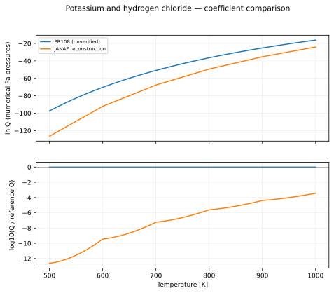
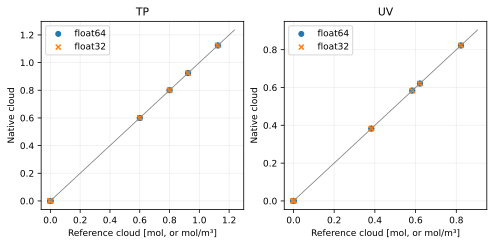

Potassium and hydrogen chloride
===============================

Reaction::

   2 K(g) + 2 HCl(g) <=> 2 KCl(condensed) + H2(g)

All plotted functions return natural log Q, with each partial pressure expressed numerically in Pa. The net pressure exponent is 3; condensed-phase activity is one. See :doc:`../equilibrium_algorithms` for the signed quotient and H2 treatment.

Data, provenance and limitations
--------------------------------

For 2K + 2HCl -> 2KCl(s) + H2, log10 Q(Pa) = 15 - 2(logKf_KCl - logKf_K - logKf_HCl), using a 1 bar standard state. H2 has zero formation Gibbs energy. The PR fit differs by orders of magnitude and is not enabled. No replacement regression is installed.

The coefficient audit was performed on 2026-10-07. Primary data links:

* `NIST-JANAF KCl(cr), log Kf column <https://janaf.nist.gov/tables/Cl-036.html>`_
* `NIST-JANAF K(g), log Kf column <https://janaf.nist.gov/tables/K-005.html>`_
* `NIST-JANAF HCl(g), log Kf column <https://janaf.nist.gov/tables/Cl-026.html>`_

Legacy values are transcribed from ``src/vapors/vapor_functions.h``. PR-only candidates are transcribed from PR 108, revision ``17ba9fb88bf1e50b06b5721b9bb604a1a0691395``. An unresolved provenance label means the fit has not been certified by this audit.

Coefficient conventions
-----------------------

``ideal`` parameters are [T3, P3, beta_liquid, gamma_liquid, beta_solid, gamma_solid]: L = ln(P3) + beta(1 - T3/T) - gamma ln(T/T3). The solid branch is selected at T <= T3. ``antoine`` parameters are [A, B, C]: L = ln(100000) + ln(10)(A - B/(T+C)). ``linear`` parameters are [A, B, base]: L = ln(base)(A - B/T). Temperatures and B/C offsets are in kelvin. ``table`` contains [temperatures, ln Q] with linear interpolation used only for display.

.. list-table::
   :header-rows: 1

   * - Formula
     - Form
     - Parameters
     - Plot interval (K)
     - Status
   * - PR108 (unverified)
     - linear
     - [65.06, 81230, 2.718281828459045]
     - 500–1000
     - comparison only; not registered
   * - JANAF reconstruction
     - table
     - See tabulated values below and source log Kf columns
     - 500–1000
     - tabulated standard-state reconstruction; linear interpolation for display

   The ratio reference is PR108 (unverified). Curves are compared only where their displayed intervals overlap; disagreement is not an uncertainty estimate.

.. list-table::
   :header-rows: 1

   * - Formula
     - T (K)
     - ln Q (Pa convention)
   * - PR108 (unverified)
     - 500
     - -97.4
   * - PR108 (unverified)
     - 750
     - -43.24666667
   * - PR108 (unverified)
     - 1000
     - -16.17
   * - JANAF reconstruction
     - 500
     - -126.4671836
   * - JANAF reconstruction
     - 750
     - -58.51559497
   * - JANAF reconstruction
     - 1000
     - -24.07122456

:download:`Numerical comparison CSV <../_static/reactions/k_hcl-values.csv>`

No verified production formula is registered for this family. Its curves above are comparison-only.

Isolated equilibrium validation
-------------------------------

This reaction is tested independently with its balanced stoichiometry and explicit gas/solid phases. The native TP and UV solvers are compared with a 100-step bracketed scalar extent solve. Manufactured caloric data and a consistent inline equilibrium curve isolate solver correctness; these results do **not** validate the physical fit above. See the algorithm page for the exact construction and acceptance thresholds.

.. list-table::
   :header-rows: 1

   * - Mode
     - Initial state
     - Runs
     - Max state error
     - Max residual violation
     - Max conservation error
     - Max energy error
     - Status
   * - TP
     - condense
     - 4
     - 6.400e-08
     - 7.866e-07
     - 3.878e-08
     - 0.000e+00
     - pass
   * - TP
     - nucleate
     - 4
     - 9.012e-08
     - 1.124e-06
     - 4.560e-08
     - 0.000e+00
     - pass
   * - TP
     - evaporate
     - 4
     - 6.727e-09
     - 0.000e+00
     - 6.727e-09
     - 0.000e+00
     - pass
   * - TP
     - clear
     - 4
     - 3.648e-09
     - 0.000e+00
     - 3.648e-09
     - 0.000e+00
     - pass
   * - TP
     - zero_h2
     - 4
     - 1.426e-07
     - 2.951e-06
     - 2.091e-08
     - 0.000e+00
     - pass
   * - TP
     - trace_h2
     - 4
     - 1.047e-07
     - 1.048e-06
     - 1.692e-07
     - 0.000e+00
     - pass
   * - TP
     - absent_reactants
     - 4
     - 6.598e-09
     - 0.000e+00
     - 6.598e-09
     - 0.000e+00
     - pass
   * - TP
     - rich_h2
     - 4
     - 2.530e-08
     - 0.000e+00
     - 2.530e-08
     - 0.000e+00
     - pass
   * - UV
     - condense
     - 4
     - 1.240e-06
     - 2.646e-06
     - 1.240e-06
     - 3.409e-07
     - pass
   * - UV
     - nucleate
     - 4
     - 2.861e-07
     - 5.508e-07
     - 2.861e-07
     - 2.924e-07
     - pass
   * - UV
     - evaporate
     - 4
     - 2.623e-08
     - 0.000e+00
     - 2.623e-08
     - 1.190e-07
     - pass
   * - UV
     - clear
     - 4
     - 9.537e-08
     - 0.000e+00
     - 9.537e-08
     - 1.199e-07
     - pass
   * - UV
     - zero_h2
     - 4
     - 3.815e-07
     - 1.064e-06
     - 3.815e-07
     - 1.655e-07
     - pass
   * - UV
     - trace_h2
     - 4
     - 9.537e-07
     - 4.880e-06
     - 9.537e-07
     - 1.751e-07
     - pass
   * - UV
     - absent_reactants
     - 4
     - 1.907e-07
     - 0.000e+00
     - 1.907e-07
     - 1.893e-08
     - pass
   * - UV
     - rich_h2
     - 4
     - 4.768e-07
     - 0.000e+00
     - 4.768e-07
     - 5.356e-08
     - pass

   Each marker is a recorded native solve. TP amounts are restored using conserved helium; UV amounts are concentrations.

Reproduce this reaction independently::

   python docs/reaction_validation.py --reaction k_hcl --cuda --output /tmp/k_hcl.json
   pytest -q tests/test_reaction_equilibrium.py -k k_hcl
