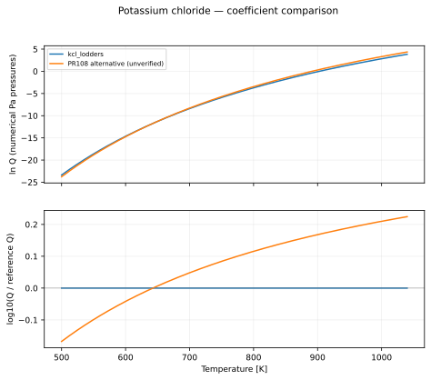
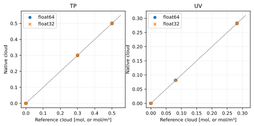

Potassium chloride
==================

Reaction::

   KCl(g) <=> KCl(condensed)

All plotted functions return natural log Q, with each partial pressure expressed numerically in Pa. The net pressure exponent is 1; condensed-phase activity is one. See :doc:`../equilibrium_algorithms` for the signed quotient and H2 treatment.

Data, provenance and limitations
--------------------------------

Convert bar to Pa by adding 5 before multiplying by ln(10). The old implementation multiplied by log10(e), and its derivative omitted ln(10). No primary source was located for the alternative coefficients. The plot stays below the 1044 K solid melting point; this is not a published fit interval.

The coefficient audit was performed on 2026-10-07. Primary data links:

* `Morley et al. (2012), Eq. 18: log10 p_KCl(bar) = 7.611 - 11382/T <https://arxiv.org/html/1206.4313>`_
* `NIST-JANAF KCl(cr), standard-state thermochemistry <https://janaf.nist.gov/tables/Cl-036.html>`_

Legacy values are transcribed from ``src/vapors/vapor_functions.h``. PR-only candidates are transcribed from PR 108, revision ``17ba9fb88bf1e50b06b5721b9bb604a1a0691395``. An unresolved provenance label means the fit has not been certified by this audit.

Coefficient conventions
-----------------------

``ideal`` parameters are [T3, P3, beta_liquid, gamma_liquid, beta_solid, gamma_solid]: L = ln(P3) + beta(1 - T3/T) - gamma ln(T/T3). The solid branch is selected at T <= T3. ``antoine`` parameters are [A, B, C]: L = ln(100000) + ln(10)(A - B/(T+C)). ``linear`` parameters are [A, B, base]: L = ln(base)(A - B/T). Temperatures and B/C offsets are in kelvin. ``table`` contains [temperatures, ln Q] with linear interpolation used only for display.

.. list-table::
   :header-rows: 1

   * - Formula
     - Form
     - Parameters
     - Plot interval (K)
     - Status
   * - kcl_lodders
     - linear
     - [12.611, 11382, 10]
     - 500–1040
     - verified conversion of Morley Eq. 18
   * - PR108 alternative (unverified)
     - linear
     - [30.39, 27077, 2.718281828459045]
     - 500–1040
     - comparison only; not registered

   The ratio reference is kcl_lodders. Curves are compared only where their displayed intervals overlap; disagreement is not an uncertainty estimate.

.. list-table::
   :header-rows: 1

   * - Formula
     - T (K)
     - ln Q (Pa convention)
   * - kcl_lodders
     - 500
     - -23.37814645
   * - kcl_lodders
     - 770
     - -4.998493585
   * - kcl_lodders
     - 1040
     - 3.837877984
   * - PR108 alternative (unverified)
     - 500
     - -23.764
   * - PR108 alternative (unverified)
     - 770
     - -4.774935065
   * - PR108 alternative (unverified)
     - 1040
     - 4.354423077

:download:`Numerical comparison CSV <../_static/reactions/kcl-values.csv>`

Native formula evaluation agrees with the offline coefficient record as follows (float64; mathematical transcription checks, not physical uncertainty):

.. list-table::
   :header-rows: 1

   * - Formula
     - Device
     - Maximum absolute ln Q difference
   * - kcl_lodders
     - cpu
     - 7.994e-15
   * - kcl_lodders
     - cuda
     - 4.441e-15

Isolated equilibrium validation
-------------------------------

This reaction is tested independently with its balanced stoichiometry and explicit gas/solid phases. The native TP and UV solvers are compared with a 100-step bracketed scalar extent solve. Manufactured caloric data and a consistent inline equilibrium curve isolate solver correctness; these results do **not** validate the physical fit above. See the algorithm page for the exact construction and acceptance thresholds.

.. list-table::
   :header-rows: 1

   * - Mode
     - Initial state
     - Runs
     - Max state error
     - Max residual violation
     - Max conservation error
     - Max energy error
     - Status
   * - TP
     - condense
     - 4
     - 5.672e-08
     - 2.852e-07
     - 1.673e-08
     - 0.000e+00
     - pass
   * - TP
     - nucleate
     - 4
     - 5.651e-08
     - 2.841e-07
     - 1.743e-08
     - 0.000e+00
     - pass
   * - TP
     - evaporate
     - 4
     - 1.116e-09
     - 0.000e+00
     - 1.116e-09
     - 0.000e+00
     - pass
   * - TP
     - clear
     - 4
     - 2.324e-10
     - 0.000e+00
     - 2.324e-10
     - 0.000e+00
     - pass
   * - TP
     - zero_h2
     - 4
     - 5.651e-08
     - 2.841e-07
     - 1.743e-08
     - 0.000e+00
     - pass
   * - TP
     - trace_h2
     - 4
     - 5.672e-08
     - 2.852e-07
     - 1.673e-08
     - 0.000e+00
     - pass
   * - TP
     - absent_reactants
     - 4
     - 6.840e-10
     - 0.000e+00
     - 6.840e-10
     - 0.000e+00
     - pass
   * - TP
     - rich_h2
     - 4
     - 5.672e-08
     - 2.852e-07
     - 1.673e-08
     - 0.000e+00
     - pass
   * - UV
     - condense
     - 4
     - 1.907e-07
     - 5.145e-07
     - 1.907e-07
     - 2.255e-07
     - pass
   * - UV
     - nucleate
     - 4
     - 1.907e-07
     - 2.054e-06
     - 1.907e-07
     - 1.961e-07
     - pass
   * - UV
     - evaporate
     - 4
     - 9.537e-10
     - 0.000e+00
     - 9.537e-10
     - 6.983e-08
     - pass
   * - UV
     - clear
     - 4
     - 9.537e-08
     - 0.000e+00
     - 9.537e-08
     - 9.419e-08
     - pass
   * - UV
     - zero_h2
     - 4
     - 1.907e-07
     - 2.054e-06
     - 1.907e-07
     - 1.961e-07
     - pass
   * - UV
     - trace_h2
     - 4
     - 1.907e-07
     - 5.145e-07
     - 1.907e-07
     - 2.255e-07
     - pass
   * - UV
     - absent_reactants
     - 4
     - 2.980e-10
     - 0.000e+00
     - 2.980e-10
     - 4.927e-08
     - pass
   * - UV
     - rich_h2
     - 4
     - 1.907e-07
     - 5.145e-07
     - 1.907e-07
     - 2.255e-07
     - pass

   Each marker is a recorded native solve. TP amounts are restored using conserved helium; UV amounts are concentrations.

Reproduce this reaction independently::

   python docs/reaction_validation.py --reaction kcl --cuda --output /tmp/kcl.json
   pytest -q tests/test_reaction_equilibrium.py -k kcl
