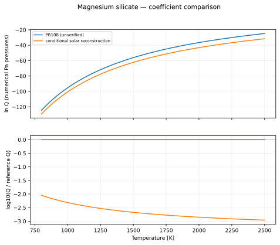
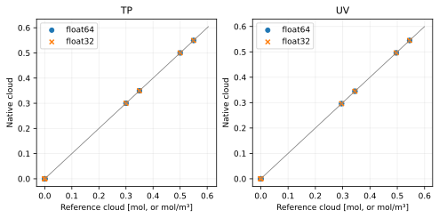

Magnesium silicate
==================

Reaction::

   Mg(g) + SiH4(g) + 3 H2O(g) <=> MgSiO3(condensed) + 5 H2(g)

All plotted functions return natural log Q, with each partial pressure expressed numerically in Pa. The net pressure exponent is 0; condensed-phase activity is one. See :doc:`../equilibrium_algorithms` for the signed quotient and H2 treatment.

Data, provenance and limitations
--------------------------------

Combining the Mg and SiH4 expressions with three H2O factors cancels the solar water abundance and pressure factors. With X_H2 = 0.84, log10 Q = 5.86 - 5 log10(0.84) - 49895/T. This is a conditional reconstruction, not a directly quoted reaction fit; the tables cover 800–2500 K and metallicities up to [Fe/H] = 0.5. Here the pressure exponent sum is zero, so the bar-to-Pa shift vanishes.

The coefficient audit was performed on 2026-10-07. Primary data links:

* `Visscher et al. (2010), Tables 2 and 3, above-cloud Mg and SiH4 <https://arxiv.org/html/1001.3639>`_

Legacy values are transcribed from ``src/vapors/vapor_functions.h``. PR-only candidates are transcribed from PR 108, revision ``17ba9fb88bf1e50b06b5721b9bb604a1a0691395``. An unresolved provenance label means the fit has not been certified by this audit.

Coefficient conventions
-----------------------

``ideal`` parameters are [T3, P3, beta_liquid, gamma_liquid, beta_solid, gamma_solid]: L = ln(P3) + beta(1 - T3/T) - gamma ln(T/T3). The solid branch is selected at T <= T3. ``antoine`` parameters are [A, B, C]: L = ln(100000) + ln(10)(A - B/(T+C)). ``linear`` parameters are [A, B, base]: L = ln(base)(A - B/T). Temperatures and B/C offsets are in kelvin. ``table`` contains [temperatures, ln Q] with linear interpolation used only for display.

.. list-table::
   :header-rows: 1

   * - Formula
     - Form
     - Parameters
     - Plot interval (K)
     - Status
   * - PR108 (unverified)
     - linear
     - [9.63, 50971, 10]
     - 800–2500
     - comparison only; not registered
   * - conditional solar reconstruction
     - linear
     - [6.238603569690592, 49895, 10]
     - 800–2500
     - derived above-cloud approximation

   The ratio reference is PR108 (unverified). Curves are compared only where their displayed intervals overlap; disagreement is not an uncertainty estimate.

.. list-table::
   :header-rows: 1

   * - Formula
     - T (K)
     - ln Q (Pa convention)
   * - PR108 (unverified)
     - 800
     - -124.5324365
   * - PR108 (unverified)
     - 1650
     - -48.95644784
   * - PR108 (unverified)
     - 2500
     - -24.77213146
   * - conditional solar reconstruction
     - 800
     - -129.2444384
   * - conditional solar reconstruction
     - 1650
     - -55.26386213
   * - conditional solar reconstruction
     - 2500
     - -31.59007771

:download:`Numerical comparison CSV <../_static/reactions/mgsio3-values.csv>`

No verified production formula is registered for this family. Its curves above are comparison-only.

Isolated equilibrium validation
-------------------------------

This reaction is tested independently with its balanced stoichiometry and explicit gas/solid phases. The native TP and UV solvers are compared with a 100-step bracketed scalar extent solve. Manufactured caloric data and a consistent inline equilibrium curve isolate solver correctness; these results do **not** validate the physical fit above. See the algorithm page for the exact construction and acceptance thresholds.

.. list-table::
   :header-rows: 1

   * - Mode
     - Initial state
     - Runs
     - Max state error
     - Max residual violation
     - Max conservation error
     - Max energy error
     - Status
   * - TP
     - condense
     - 4
     - 2.108e-08
     - 4.761e-07
     - 1.844e-08
     - 0.000e+00
     - pass
   * - TP
     - nucleate
     - 4
     - 1.228e-08
     - 5.216e-07
     - 2.034e-08
     - 0.000e+00
     - pass
   * - TP
     - evaporate
     - 4
     - 1.283e-08
     - 0.000e+00
     - 1.283e-08
     - 0.000e+00
     - pass
   * - TP
     - clear
     - 4
     - 7.331e-09
     - 0.000e+00
     - 7.331e-09
     - 0.000e+00
     - pass
   * - TP
     - zero_h2
     - 4
     - 2.797e-08
     - 2.143e-07
     - 2.426e-08
     - 0.000e+00
     - pass
   * - TP
     - trace_h2
     - 4
     - 3.478e-08
     - 3.247e-07
     - 2.557e-08
     - 0.000e+00
     - pass
   * - TP
     - absent_reactants
     - 4
     - 7.153e-09
     - 0.000e+00
     - 7.153e-09
     - 0.000e+00
     - pass
   * - TP
     - rich_h2
     - 4
     - 2.146e-08
     - 0.000e+00
     - 2.146e-08
     - 0.000e+00
     - pass
   * - UV
     - condense
     - 4
     - 4.768e-07
     - 6.042e-07
     - 4.768e-07
     - 3.876e-07
     - pass
   * - UV
     - nucleate
     - 4
     - 5.722e-07
     - 9.919e-07
     - 5.722e-07
     - 9.486e-08
     - pass
   * - UV
     - evaporate
     - 4
     - 9.537e-08
     - 0.000e+00
     - 9.537e-08
     - 1.227e-07
     - pass
   * - UV
     - clear
     - 4
     - 9.537e-08
     - 0.000e+00
     - 9.537e-08
     - 1.379e-07
     - pass
   * - UV
     - zero_h2
     - 4
     - 9.537e-08
     - 3.458e-07
     - 9.537e-08
     - 1.029e-07
     - pass
   * - UV
     - trace_h2
     - 4
     - 4.768e-07
     - 4.353e-07
     - 4.768e-07
     - 9.162e-08
     - pass
   * - UV
     - absent_reactants
     - 4
     - 9.537e-08
     - 0.000e+00
     - 9.537e-08
     - 1.811e-07
     - pass
   * - UV
     - rich_h2
     - 4
     - 1.907e-07
     - 0.000e+00
     - 1.907e-07
     - 8.278e-08
     - pass

   Each marker is a recorded native solve. TP amounts are restored using conserved helium; UV amounts are concentrations.

Reproduce this reaction independently::

   python docs/reaction_validation.py --reaction mgsio3 --cuda --output /tmp/mgsio3.json
   pytest -q tests/test_reaction_equilibrium.py -k mgsio3
