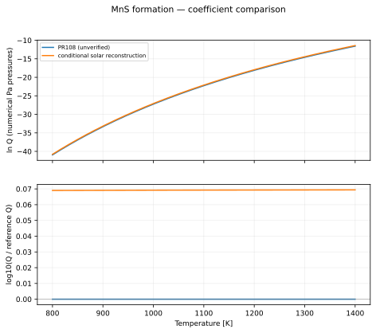
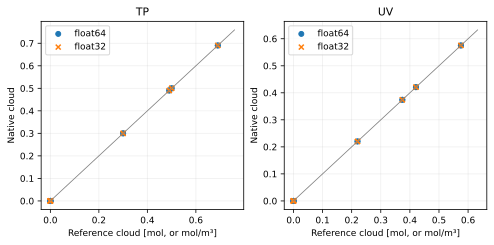

MnS formation
=============

Reaction::

   Mn(g) + H2S(g) <=> MnS(condensed) + H2(g)

All plotted functions return natural log Q, with each partial pressure expressed numerically in Pa. The net pressure exponent is 1; condensed-phase activity is one. See :doc:`../equilibrium_algorithms` for the signed quotient and H2 treatment.

Data, provenance and limitations
--------------------------------

Metal saturation partial pressure is not the full reaction quotient. The comparison reconstructs Q using log10 X_H2S = -4.56 and X_H2 = 0.84 at solar metallicity, giving log10(X_H2S/X_H2) = -4.484279286. Its 800–1400 K plotting interval is not a verified validity range. No unconditional coefficient correction follows from this assumption. For the PR natural-log Mn fit, the derivative is 54823/T²; multiplying by ln(10) again was an error. This derivative correction does not verify the fitted coefficients.

The coefficient audit was performed on 2026-10-07. Primary data links:

* `Morley et al. (2012), Eqs. 9, 12, 15 (metal partial pressures) <https://arxiv.org/html/1206.4313>`_
* `Visscher et al. (2006), Eqs. 16, 25–30 (solar sulfur chemistry) <https://arxiv.org/abs/astro-ph/0511136>`_

Legacy values are transcribed from ``src/vapors/vapor_functions.h``. PR-only candidates are transcribed from PR 108, revision ``17ba9fb88bf1e50b06b5721b9bb604a1a0691395``. An unresolved provenance label means the fit has not been certified by this audit.

Coefficient conventions
-----------------------

``ideal`` parameters are [T3, P3, beta_liquid, gamma_liquid, beta_solid, gamma_solid]: L = ln(P3) + beta(1 - T3/T) - gamma ln(T/T3). The solid branch is selected at T <= T3. ``antoine`` parameters are [A, B, C]: L = ln(100000) + ln(10)(A - B/(T+C)). ``linear`` parameters are [A, B, base]: L = ln(base)(A - B/T). Temperatures and B/C offsets are in kelvin. ``table`` contains [temperatures, ln Q] with linear interpolation used only for display.

.. list-table::
   :header-rows: 1

   * - Formula
     - Form
     - Parameters
     - Plot interval (K)
     - Status
   * - PR108 (unverified)
     - linear
     - [27.58, 54823, 2.718281828459045]
     - 800–1400
     - comparison only; not registered
   * - conditional solar reconstruction
     - linear
     - [12.04772071393812, 23810, 10]
     - 800–1400
     - derived under fixed solar H2S/H2; not a published Q fit

   The ratio reference is PR108 (unverified). Curves are compared only where their displayed intervals overlap; disagreement is not an uncertainty estimate.

.. list-table::
   :header-rows: 1

   * - Formula
     - T (K)
     - ln Q (Pa convention)
   * - PR108 (unverified)
     - 800
     - -40.94875
   * - PR108 (unverified)
     - 1100
     - -22.25909091
   * - PR108 (unverified)
     - 1400
     - -11.57928571
   * - conditional solar reconstruction
     - 800
     - -40.78978671
   * - conditional solar reconstruction
     - 1100
     - -22.09959885
   * - conditional solar reconstruction
     - 1400
     - -11.4194915

:download:`Numerical comparison CSV <../_static/reactions/mns-values.csv>`

No verified production formula is registered for this family. Its curves above are comparison-only.

Isolated equilibrium validation
-------------------------------

This reaction is tested independently with its balanced stoichiometry and explicit gas/solid phases. The native TP and UV solvers are compared with a 100-step bracketed scalar extent solve. Manufactured caloric data and a consistent inline equilibrium curve isolate solver correctness; these results do **not** validate the physical fit above. See the algorithm page for the exact construction and acceptance thresholds.

.. list-table::
   :header-rows: 1

   * - Mode
     - Initial state
     - Runs
     - Max state error
     - Max residual violation
     - Max conservation error
     - Max energy error
     - Status
   * - TP
     - condense
     - 4
     - 1.530e-07
     - 4.139e-06
     - 3.176e-08
     - 0.000e+00
     - pass
   * - TP
     - nucleate
     - 4
     - 1.509e-07
     - 4.082e-06
     - 6.925e-09
     - 0.000e+00
     - pass
   * - TP
     - evaporate
     - 4
     - 7.343e-09
     - 0.000e+00
     - 7.343e-09
     - 0.000e+00
     - pass
   * - TP
     - clear
     - 4
     - 7.224e-09
     - 0.000e+00
     - 7.224e-09
     - 0.000e+00
     - pass
   * - TP
     - zero_h2
     - 4
     - 1.284e-08
     - 4.102e-07
     - 1.147e-08
     - 0.000e+00
     - pass
   * - TP
     - trace_h2
     - 4
     - 1.789e-08
     - 2.755e-07
     - 1.227e-08
     - 0.000e+00
     - pass
   * - TP
     - absent_reactants
     - 4
     - 1.382e-08
     - 0.000e+00
     - 1.382e-08
     - 0.000e+00
     - pass
   * - TP
     - rich_h2
     - 4
     - 2.596e-08
     - 0.000e+00
     - 2.596e-08
     - 0.000e+00
     - pass
   * - UV
     - condense
     - 4
     - 4.768e-07
     - 1.042e-06
     - 4.768e-07
     - 3.846e-07
     - pass
   * - UV
     - nucleate
     - 4
     - 2.861e-07
     - 1.764e-06
     - 2.861e-07
     - 1.676e-07
     - pass
   * - UV
     - evaporate
     - 4
     - 7.153e-09
     - 0.000e+00
     - 7.153e-09
     - 1.098e-07
     - pass
   * - UV
     - clear
     - 4
     - 2.384e-10
     - 0.000e+00
     - 2.384e-10
     - 6.095e-08
     - pass
   * - UV
     - zero_h2
     - 4
     - 9.537e-08
     - 4.455e-07
     - 9.537e-08
     - 1.099e-07
     - pass
   * - UV
     - trace_h2
     - 4
     - 1.907e-07
     - 6.455e-07
     - 1.907e-07
     - 2.755e-07
     - pass
   * - UV
     - absent_reactants
     - 4
     - 9.537e-08
     - 0.000e+00
     - 9.537e-08
     - 5.904e-08
     - pass
   * - UV
     - rich_h2
     - 4
     - 6.676e-07
     - 0.000e+00
     - 6.676e-07
     - 1.763e-07
     - pass

   Each marker is a recorded native solve. TP amounts are restored using conserved helium; UV amounts are concentrations.

Reproduce this reaction independently::

   python docs/reaction_validation.py --reaction mns --cuda --output /tmp/mns.json
   pytest -q tests/test_reaction_equilibrium.py -k mns
