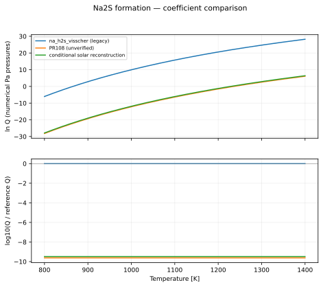
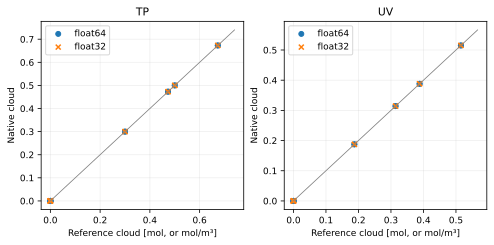

Na2S formation
==============

Reaction::

   2 Na(g) + H2S(g) <=> Na2S(condensed) + H2(g)

All plotted functions return natural log Q, with each partial pressure expressed numerically in Pa. The net pressure exponent is 2; condensed-phase activity is one. See :doc:`../equilibrium_algorithms` for the signed quotient and H2 treatment.

Data, provenance and limitations
--------------------------------

Metal saturation partial pressure is not the full reaction quotient. The comparison reconstructs Q using log10 X_H2S = -4.56 and X_H2 = 0.84 at solar metallicity, giving log10(X_H2S/X_H2) = -4.484279286. Its 800–1400 K plotting interval is not a verified validity range. No unconditional coefficient correction follows from this assumption. For Na2S, production now adopts the PR108 intercept 22.48 instead of the legacy 32.1. The conditional reconstruction gives 22.61572: a factor of 1.367 in Q, or 1.169 in sodium saturation pressure at fixed H2S/H2. This supports the approximate correction but does not establish exact coefficient provenance or a validity interval. The Pa quotient has net pressure exponent two: log10 Q(Pa) = log10 Q(bar) + 10; no additional conversion is applied to 22.48.

The coefficient audit was performed on 2026-10-07. Primary data links:

* `Morley et al. (2012), Eqs. 9, 12, 15 (metal partial pressures) <https://arxiv.org/html/1206.4313>`_
* `Visscher et al. (2006), Eqs. 16, 25–30 (solar sulfur chemistry) <https://arxiv.org/abs/astro-ph/0511136>`_

Legacy values are transcribed from ``src/vapors/vapor_functions.h``. PR-only candidates are transcribed from PR 108, revision ``17ba9fb88bf1e50b06b5721b9bb604a1a0691395``. An unresolved provenance label means the fit has not been certified by this audit.

Coefficient conventions
-----------------------

``ideal`` parameters are [T3, P3, beta_liquid, gamma_liquid, beta_solid, gamma_solid]: L = ln(P3) + beta(1 - T3/T) - gamma ln(T/T3). The solid branch is selected at T <= T3. ``antoine`` parameters are [A, B, C]: L = ln(100000) + ln(10)(A - B/(T+C)). ``linear`` parameters are [A, B, base]: L = ln(base)(A - B/T). Temperatures and B/C offsets are in kelvin. ``table`` contains [temperatures, ln Q] with linear interpolation used only for display.

.. list-table::
   :header-rows: 1

   * - Formula
     - Form
     - Parameters
     - Plot interval (K)
     - Status
   * - na_h2s_visscher
     - linear
     - [22.48, 27778, 10]
     - 800–1400
     - adopted PR108 approximation; exact coefficient provenance unresolved
   * - conditional solar reconstruction
     - linear
     - [22.61572071393812, 27778, 10]
     - 800–1400
     - derived under fixed solar H2S/H2; not a published Q fit
   * - superseded legacy fit
     - linear
     - [32.1, 27778, 10]
     - 800–1400
     - historical comparison only; not registered

   The ratio reference is na_h2s_visscher. Curves are compared only where their displayed intervals overlap; disagreement is not an uncertainty estimate.

.. list-table::
   :header-rows: 1

   * - Formula
     - T (K)
     - ln Q (Pa convention)
   * - na_h2s_visscher
     - 800
     - -28.189398
   * - na_h2s_visscher
     - 1100
     - -6.384440485
   * - na_h2s_visscher
     - 1400
     - 6.075535238
   * - conditional solar reconstruction
     - 800
     - -27.87688951
   * - conditional solar reconstruction
     - 1100
     - -6.071931992
   * - conditional solar reconstruction
     - 1400
     - 6.388043731
   * - superseded legacy fit
     - 800
     - -6.038529406
   * - superseded legacy fit
     - 1100
     - 15.76642811
   * - superseded legacy fit
     - 1400
     - 28.22640383

:download:`Numerical comparison CSV <../_static/reactions/na2s-values.csv>`

Native formula evaluation agrees with the offline coefficient record as follows (float64; mathematical transcription checks, not physical uncertainty):

.. list-table::
   :header-rows: 1

   * - Formula
     - Device
     - Maximum absolute ln Q difference
   * - na_h2s_visscher
     - cpu
     - 3.553e-15
   * - na_h2s_visscher
     - cuda
     - 3.553e-15

Isolated equilibrium validation
-------------------------------

This reaction is tested independently with its balanced stoichiometry and explicit gas/solid phases. The native TP and UV solvers are compared with a 100-step bracketed scalar extent solve. Manufactured caloric data and a consistent inline equilibrium curve isolate solver correctness; these results do **not** validate the physical fit above. See the algorithm page for the exact construction and acceptance thresholds.

.. list-table::
   :header-rows: 1

   * - Mode
     - Initial state
     - Runs
     - Max state error
     - Max residual violation
     - Max conservation error
     - Max energy error
     - Status
   * - TP
     - condense
     - 4
     - 4.683e-08
     - 1.147e-06
     - 1.955e-08
     - 0.000e+00
     - pass
   * - TP
     - nucleate
     - 4
     - 8.106e-08
     - 1.373e-06
     - 1.788e-08
     - 0.000e+00
     - pass
   * - TP
     - evaporate
     - 4
     - 5.999e-09
     - 0.000e+00
     - 5.999e-09
     - 0.000e+00
     - pass
   * - TP
     - clear
     - 4
     - 7.260e-09
     - 0.000e+00
     - 7.260e-09
     - 0.000e+00
     - pass
   * - TP
     - zero_h2
     - 4
     - 5.398e-08
     - 8.992e-07
     - 1.157e-08
     - 0.000e+00
     - pass
   * - TP
     - trace_h2
     - 4
     - 4.471e-08
     - 8.919e-07
     - 6.140e-08
     - 0.000e+00
     - pass
   * - TP
     - absent_reactants
     - 4
     - 1.183e-08
     - 0.000e+00
     - 1.183e-08
     - 0.000e+00
     - pass
   * - TP
     - rich_h2
     - 4
     - 1.888e-08
     - 0.000e+00
     - 1.888e-08
     - 0.000e+00
     - pass
   * - UV
     - condense
     - 4
     - 7.629e-07
     - 3.097e-06
     - 7.629e-07
     - 7.301e-08
     - pass
   * - UV
     - nucleate
     - 4
     - 2.861e-07
     - 2.304e-06
     - 2.861e-07
     - 1.383e-07
     - pass
   * - UV
     - evaporate
     - 4
     - 4.768e-09
     - 0.000e+00
     - 4.768e-09
     - 1.057e-07
     - pass
   * - UV
     - clear
     - 4
     - 9.537e-08
     - 0.000e+00
     - 9.537e-08
     - 7.588e-08
     - pass
   * - UV
     - zero_h2
     - 4
     - 3.815e-07
     - 9.671e-07
     - 3.815e-07
     - 1.665e-07
     - pass
   * - UV
     - trace_h2
     - 4
     - 6.753e-07
     - 2.010e-05
     - 9.537e-08
     - 1.719e-07
     - pass
   * - UV
     - absent_reactants
     - 4
     - 9.537e-08
     - 0.000e+00
     - 9.537e-08
     - 1.689e-07
     - pass
   * - UV
     - rich_h2
     - 4
     - 1.907e-07
     - 0.000e+00
     - 1.907e-07
     - 1.546e-07
     - pass

   Each marker is a recorded native solve. TP amounts are restored using conserved helium; UV amounts are concentrations.

Reproduce this reaction independently::

   python docs/reaction_validation.py --reaction na2s --cuda --output /tmp/na2s.json
   pytest -q tests/test_reaction_equilibrium.py -k na2s
