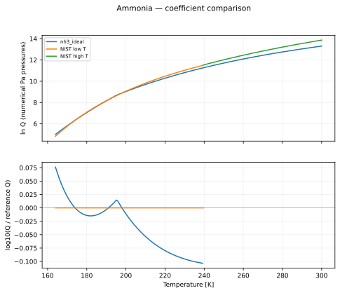
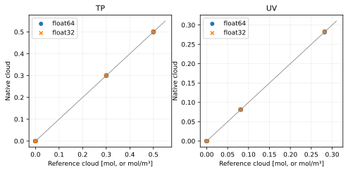

Ammonia
========

Reaction::

   NH3(g) <=> NH3(condensed)

All plotted functions return natural log Q, with each partial pressure expressed numerically in Pa. The net pressure exponent is 1; condensed-phase activity is one. See :doc:`../equilibrium_algorithms` for the signed quotient and H2 treatment.

Data, provenance and limitations
--------------------------------

The ideal solid/liquid switch is 195.4 K. Its fitted beta/gamma provenance is unresolved; the comparison does not certify either branch.

The coefficient audit was performed on 2026-10-07. Primary data links:

* `Stull (1947), NIST Antoine table (high branch valid to 371.5 K) <https://webbook.nist.gov/cgi/cbook.cgi?ID=C7664417&Mask=4&Type=ANTOINE&Plot=on>`_

Legacy values are transcribed from ``src/vapors/vapor_functions.h``. PR-only candidates are transcribed from PR 108, revision ``17ba9fb88bf1e50b06b5721b9bb604a1a0691395``. An unresolved provenance label means the fit has not been certified by this audit.

Coefficient conventions
-----------------------

``ideal`` parameters are [T3, P3, beta_liquid, gamma_liquid, beta_solid, gamma_solid]: L = ln(P3) + beta(1 - T3/T) - gamma ln(T/T3). The solid branch is selected at T <= T3. ``antoine`` parameters are [A, B, C]: L = ln(100000) + ln(10)(A - B/(T+C)). ``linear`` parameters are [A, B, base]: L = ln(base)(A - B/T). Temperatures and B/C offsets are in kelvin. ``table`` contains [temperatures, ln Q] with linear interpolation used only for display.

.. list-table::
   :header-rows: 1

   * - Formula
     - Form
     - Parameters
     - Plot interval (K)
     - Status
   * - nh3_ideal
     - ideal
     - [195.4, 6060, 20.08, 5.62, 20.64, 1.43]
     - 164–300
     - legacy; coefficient provenance unresolved
   * - NIST low T
     - antoine
     - [3.18757, 506.713, -80.78]
     - 164–239.6
     - NIST WebBook Antoine table
   * - NIST high T
     - antoine
     - [4.86886, 1113.928, -10.409]
     - 239.6–300
     - NIST WebBook Antoine table

   The ratio reference is NIST low T. Curves are compared only where their displayed intervals overlap; disagreement is not an uncertainty estimate.

.. list-table::
   :header-rows: 1

   * - Formula
     - T (K)
     - ln Q (Pa convention)
   * - nh3_ideal
     - 164
     - 5.008170907
   * - nh3_ideal
     - 232
     - 10.91236807
   * - nh3_ideal
     - 300
     - 13.30120815
   * - NIST low T
     - 164
     - 4.832511739
   * - NIST low T
     - 201.8
     - 9.211609846
   * - NIST low T
     - 239.6
     - 11.50621093
   * - NIST high T
     - 239.6
     - 11.53272619
   * - NIST high T
     - 269.8
     - 12.8356748
   * - NIST high T
     - 300
     - 13.8668674

:download:`Numerical comparison CSV <../_static/reactions/nh3-values.csv>`

Native formula evaluation agrees with the offline coefficient record as follows (float64; mathematical transcription checks, not physical uncertainty):

.. list-table::
   :header-rows: 1

   * - Formula
     - Device
     - Maximum absolute ln Q difference
   * - nh3_ideal
     - cpu
     - 3.553e-15
   * - nh3_ideal
     - cuda
     - 3.553e-15

Isolated equilibrium validation
-------------------------------

This reaction is tested independently with its balanced stoichiometry and explicit gas/solid phases. The native TP and UV solvers are compared with a 100-step bracketed scalar extent solve. Manufactured caloric data and a consistent inline equilibrium curve isolate solver correctness; these results do **not** validate the physical fit above. See the algorithm page for the exact construction and acceptance thresholds.

.. list-table::
   :header-rows: 1

   * - Mode
     - Initial state
     - Runs
     - Max state error
     - Max residual violation
     - Max conservation error
     - Max energy error
     - Status
   * - TP
     - condense
     - 4
     - 5.672e-08
     - 2.852e-07
     - 1.673e-08
     - 0.000e+00
     - pass
   * - TP
     - nucleate
     - 4
     - 5.651e-08
     - 2.841e-07
     - 1.743e-08
     - 0.000e+00
     - pass
   * - TP
     - evaporate
     - 4
     - 1.116e-09
     - 0.000e+00
     - 1.116e-09
     - 0.000e+00
     - pass
   * - TP
     - clear
     - 4
     - 2.324e-10
     - 0.000e+00
     - 2.324e-10
     - 0.000e+00
     - pass
   * - TP
     - zero_h2
     - 4
     - 5.651e-08
     - 2.841e-07
     - 1.743e-08
     - 0.000e+00
     - pass
   * - TP
     - trace_h2
     - 4
     - 5.672e-08
     - 2.852e-07
     - 1.673e-08
     - 0.000e+00
     - pass
   * - TP
     - absent_reactants
     - 4
     - 6.840e-10
     - 0.000e+00
     - 6.840e-10
     - 0.000e+00
     - pass
   * - TP
     - rich_h2
     - 4
     - 5.672e-08
     - 2.852e-07
     - 1.673e-08
     - 0.000e+00
     - pass
   * - UV
     - condense
     - 4
     - 1.907e-07
     - 1.944e-07
     - 1.907e-07
     - 1.090e-07
     - pass
   * - UV
     - nucleate
     - 4
     - 9.537e-08
     - 4.270e-07
     - 9.537e-08
     - 1.199e-08
     - pass
   * - UV
     - evaporate
     - 4
     - 2.027e-09
     - 0.000e+00
     - 2.027e-09
     - 6.692e-08
     - pass
   * - UV
     - clear
     - 4
     - 9.537e-08
     - 0.000e+00
     - 9.537e-08
     - 9.382e-08
     - pass
   * - UV
     - zero_h2
     - 4
     - 9.537e-08
     - 4.270e-07
     - 9.537e-08
     - 1.199e-08
     - pass
   * - UV
     - trace_h2
     - 4
     - 1.907e-07
     - 1.944e-07
     - 1.907e-07
     - 1.090e-07
     - pass
   * - UV
     - absent_reactants
     - 4
     - 9.537e-08
     - 0.000e+00
     - 9.537e-08
     - 1.083e-07
     - pass
   * - UV
     - rich_h2
     - 4
     - 1.907e-07
     - 1.944e-07
     - 1.907e-07
     - 1.090e-07
     - pass

   Each marker is a recorded native solve. TP amounts are restored using conserved helium; UV amounts are concentrations.

Reproduce this reaction independently::

   python docs/reaction_validation.py --reaction nh3 --cuda --output /tmp/nh3.json
   pytest -q tests/test_reaction_equilibrium.py -k nh3
