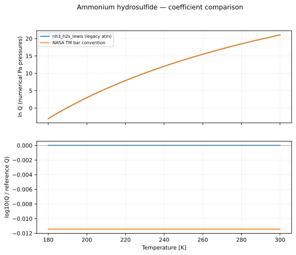
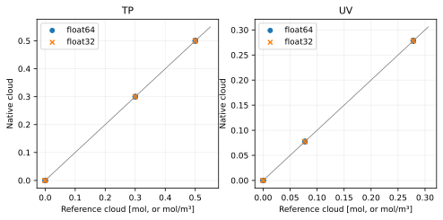

Ammonium hydrosulfide
=====================

Reaction::

   NH3(g) + H2S(g) <=> NH4SH(condensed)

All plotted functions return natural log Q, with each partial pressure expressed numerically in Pa. The net pressure exponent is 2; condensed-phase activity is one. See :doc:`../equilibrium_algorithms` for the signed quotient and H2 treatment.

Data, provenance and limitations
--------------------------------

Q = p_NH3 p_H2S. The implementation uses log10 and atm squared. NASA TM gives the same numbers with bar pressures. The original Lewis coefficient table was not verified: preserve the public implementation and expose the 2.67 percent pressure-product difference; do not silently change conventions. The plotted 180–300 K interval is illustrative.

The coefficient audit was performed on 2026-10-07. Primary data links:

* `Larson et al. (1984), NASA TM 86661, Eqs. 5a–5b, citing Lewis (1969) <https://ntrs.nasa.gov/api/citations/19850004528/downloads/19850004528.pdf>`_

Legacy values are transcribed from ``src/vapors/vapor_functions.h``. PR-only candidates are transcribed from PR 108, revision ``17ba9fb88bf1e50b06b5721b9bb604a1a0691395``. An unresolved provenance label means the fit has not been certified by this audit.

Coefficient conventions
-----------------------

``ideal`` parameters are [T3, P3, beta_liquid, gamma_liquid, beta_solid, gamma_solid]: L = ln(P3) + beta(1 - T3/T) - gamma ln(T/T3). The solid branch is selected at T <= T3. ``antoine`` parameters are [A, B, C]: L = ln(100000) + ln(10)(A - B/(T+C)). ``linear`` parameters are [A, B, base]: L = ln(base)(A - B/T). Temperatures and B/C offsets are in kelvin. ``table`` contains [temperatures, ln Q] with linear interpolation used only for display.

.. list-table::
   :header-rows: 1

   * - Formula
     - Form
     - Parameters
     - Plot interval (K)
     - Status
   * - nh3_h2s_lewis (legacy atm)
     - linear
     - [24.831433224827464, 4705, 10]
     - 180–300
     - legacy atm-squared convention
   * - NASA TM bar convention
     - linear
     - [24.82, 4705, 10]
     - 180–300
     - comparison only; unit ambiguity unresolved

   The ratio reference is nh3_h2s_lewis (legacy atm). Curves are compared only where their displayed intervals overlap; disagreement is not an uncertainty estimate.

.. list-table::
   :header-rows: 1

   * - Formula
     - T (K)
     - ln Q (Pa convention)
   * - nh3_h2s_lewis (legacy atm)
     - 180
     - -3.010527922
   * - nh3_h2s_lewis (legacy atm)
     - 240
     - 12.03622605
   * - nh3_h2s_lewis (legacy atm)
     - 300
     - 21.06427844
   * - NASA TM bar convention
     - 180
     - -3.036853895
   * - NASA TM bar convention
     - 240
     - 12.00990008
   * - NASA TM bar convention
     - 300
     - 21.03795247

:download:`Numerical comparison CSV <../_static/reactions/nh4sh-values.csv>`

Native formula evaluation agrees with the offline coefficient record as follows (float64; mathematical transcription checks, not physical uncertainty):

.. list-table::
   :header-rows: 1

   * - Formula
     - Device
     - Maximum absolute ln Q difference
   * - nh3_h2s_lewis (legacy atm)
     - cpu
     - 1.066e-14
   * - nh3_h2s_lewis (legacy atm)
     - cuda
     - 1.066e-14

Isolated equilibrium validation
-------------------------------

This reaction is tested independently with its balanced stoichiometry and explicit gas/solid phases. The native TP and UV solvers are compared with a 100-step bracketed scalar extent solve. Manufactured caloric data and a consistent inline equilibrium curve isolate solver correctness; these results do **not** validate the physical fit above. See the algorithm page for the exact construction and acceptance thresholds.

.. list-table::
   :header-rows: 1

   * - Mode
     - Initial state
     - Runs
     - Max state error
     - Max residual violation
     - Max conservation error
     - Max energy error
     - Status
   * - TP
     - condense
     - 4
     - 6.317e-08
     - 5.237e-07
     - 3.521e-09
     - 0.000e+00
     - pass
   * - TP
     - nucleate
     - 4
     - 1.511e-08
     - 1.326e-07
     - 5.614e-09
     - 0.000e+00
     - pass
   * - TP
     - evaporate
     - 4
     - 7.838e-10
     - 0.000e+00
     - 7.838e-10
     - 0.000e+00
     - pass
   * - TP
     - clear
     - 4
     - 3.468e-10
     - 0.000e+00
     - 3.468e-10
     - 0.000e+00
     - pass
   * - TP
     - zero_h2
     - 4
     - 1.511e-08
     - 1.326e-07
     - 5.614e-09
     - 0.000e+00
     - pass
   * - TP
     - trace_h2
     - 4
     - 6.317e-08
     - 5.237e-07
     - 3.521e-09
     - 0.000e+00
     - pass
   * - TP
     - absent_reactants
     - 4
     - 6.199e-10
     - 0.000e+00
     - 6.199e-10
     - 0.000e+00
     - pass
   * - TP
     - rich_h2
     - 4
     - 6.317e-08
     - 5.237e-07
     - 3.521e-09
     - 0.000e+00
     - pass
   * - UV
     - condense
     - 4
     - 3.558e-08
     - 5.411e-07
     - 1.669e-08
     - 7.282e-08
     - pass
   * - UV
     - nucleate
     - 4
     - 1.907e-07
     - 8.616e-07
     - 1.907e-07
     - 8.323e-08
     - pass
   * - UV
     - evaporate
     - 4
     - 9.537e-08
     - 0.000e+00
     - 9.537e-08
     - 3.296e-08
     - pass
   * - UV
     - clear
     - 4
     - 9.537e-08
     - 0.000e+00
     - 9.537e-08
     - 3.199e-08
     - pass
   * - UV
     - zero_h2
     - 4
     - 1.907e-07
     - 8.616e-07
     - 1.907e-07
     - 8.323e-08
     - pass
   * - UV
     - trace_h2
     - 4
     - 3.558e-08
     - 5.411e-07
     - 1.669e-08
     - 7.282e-08
     - pass
   * - UV
     - absent_reactants
     - 4
     - 2.980e-10
     - 0.000e+00
     - 2.980e-10
     - 3.574e-08
     - pass
   * - UV
     - rich_h2
     - 4
     - 3.558e-08
     - 5.411e-07
     - 1.669e-08
     - 7.282e-08
     - pass

   Each marker is a recorded native solve. TP amounts are restored using conserved helium; UV amounts are concentrations.

Reproduce this reaction independently::

   python docs/reaction_validation.py --reaction nh4sh --cuda --output /tmp/nh4sh.json
   pytest -q tests/test_reaction_equilibrium.py -k nh4sh
